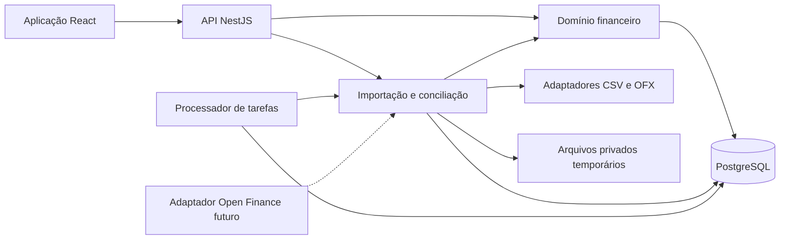

# Arquitetura e tecnologias

> Arquitetura geral aprovada em 08/10/2026. Este documento define o destino planejado; consulte [progresso](progress.md) e [tasks](tasks/README.md) para saber o que está implementado.

## System design

O backend será um único sistema implantável, organizado por módulos de domínio. PostgreSQL será a fonte de verdade para lançamentos, vínculos, importações e cálculos financeiros.

O processador de tarefas utilizará o mesmo código do backend. Poderá rodar em processo separado para evitar que parsing e importações prejudiquem as requisições interativas. Uma fila persistida em PostgreSQL é suficiente inicialmente; Redis e mensageria distribuída só seriam introduzidos mediante necessidade medida.

Dentro dos módulos, propõem-se quatro responsabilidades claras: interface HTTP, casos de uso, regras de domínio e persistência/adaptadores. As regras de parcelamento, reconhecimento financeiro e conciliação não dependerão de controllers ou componentes React.

A lista central de movimentações será uma **consulta unificada sobre os conceitos do domínio**. Não será necessário colocar compras, faturas, reembolsos e transferências numa única tabela genérica.

Os padrões têm aplicações concretas:

- **Adapter:** formatos CSV, OFX e provedores futuros.
- **Strategy:** interpretação de layouts e regras explícitas de faturamento.
- **Repository:** persistência de agregados relevantes, sem criar abstrações genéricas para cada tabela.

## Stack e alternativas

As linhas abaixo foram verificadas na documentação oficial consultada em **8 de outubro de 2026**. Na implementação, as versões exatas deverão ser fixadas e verificadas em conjunto.

| Componente | Proposta | Justificativa |
|---|---|---|
| Frontend | React 19.3 e Vite 8.3 | Aplicação autenticada, predominantemente interativa; construção e hospedagem simples |
| Backend | NestJS 12.1, TypeScript e Node.js 24 LTS | Organização modular e uma linguagem entre frontend e backend |
| Banco | PostgreSQL 18, com atualização corretiva vigente | Transações, restrições relacionais e consultas financeiras |
| Persistência | Prisma 7 estável, com SQL explícito quando necessário | Produtividade sem abrir mão de restrições e consultas específicas |
| API | REST e OpenAPI | Contratos verificáveis e cliente frontend gerado |
| Autenticação | Better Auth com sessões persistidas | Fluxos de autenticação apoiados por biblioteca; sessões revogáveis |
| Consultas frontend | TanStack Query | Cache de dados remotos e atualização após mutações |
| Formulários | React Hook Form e Zod | Validação e formulários adaptáveis |
| Interface | Componentes acessíveis baseados em Radix/shadcn, com tokens próprios | Consistência e controle visual |
| Testes | Vitest, PostgreSQL real em integração e Playwright | Cobertura do domínio, persistência e jornadas |
| Ambiente | Docker Compose e CI no GitHub | Execução reproduzível e validação automática |

As referências oficiais consultadas confirmam as linhas de [React](https://react.dev/versions), [Vite](https://vite.dev/releases), [NestJS](https://github.com/nestjs/nest/releases), [Node.js](https://github.com/nodejs/Release) e [PostgreSQL](https://www.postgresql.org/support/versioning/). A documentação consultada apresenta Prisma 8 como release candidate; por isso, propõe-se a linha 7 estável como base inicial. [Prisma](https://www.prisma.io/docs/prisma-orm/add-to-existing-project/postgresql)

**React versus Next.js:** Next.js oferece renderização no servidor, streaming e Server Components. Esses recursos têm utilidade, mas não são determinantes para este painel autenticado com API própria. A proposta é React com Vite para reduzir as camadas de execução. Next.js poderá ser reavaliado se páginas públicas, SEO ou renderização no servidor se tornarem requisitos relevantes. [Documentação do Next.js](https://nextjs.org/docs/app/getting-started/server-and-client-components)

**NestJS versus Spring Boot:** ambos atendem ao domínio. Spring Boot seria uma boa escolha se o objetivo profissional principal fosse demonstrar Java e seu ecossistema. A documentação consultada apresenta Spring Boot 4.1.1. Para este projeto, recomenda-se NestJS pela continuidade em TypeScript e pelo menor custo de manter duas stacks. A integridade financeira dependerá principalmente do modelo, das transações e dos testes. [Documentação do Spring Boot](https://docs.spring.io/spring-boot/system-requirements.html)

Valores financeiros serão calculados no backend. O frontend formatará os resultados, evitando fórmulas independentes que possam divergir entre telas.

## Módulos

| Módulo | Responsabilidade |
|---|---|
| Identidade e acesso | Usuários, sessões, recuperação de acesso e autorização |
| Contas | Contas bancárias, carteiras manuais, saldos de referência e extratos |
| Cartões | Contas de crédito, cartões físicos/virtuais/adicionais, faturas e limites |
| Operações financeiras | Receitas, despesas, compras, transferências, ajustes e estornos |
| Planejamento | Recorrências, parcelas previstas e compromissos futuros |
| Terceiros | Pessoas, valores a receber/a pagar e liquidações |
| Importação e conciliação | Arquivos, adaptadores, revisão, correspondências e confirmação |
| Categorias e orçamento | Categorias, regras determinísticas e metas mensais |
| Consultas e relatórios | Visão centralizada, dashboard anual e projeções |
| Auditoria e tarefas | Histórico de alterações, processamento e acompanhamento de falhas |

Cada módulo terá suas regras de escrita. Relatórios poderão consultar dados de vários módulos, mas não alterar seus registros diretamente.

Open Finance entrará posteriormente como outra origem de dados, utilizando os mecanismos existentes de normalização, identidade externa e conciliação.

## Decisões e contratos

Consulte os [ADRs](decisions/README.md), os [contratos](contracts.md), a [importação](imports.md) e a [segurança](security.md). As versões efetivamente instaladas são definidas pelos manifests e pelo package-lock.json; as versões mencionadas no planejamento são referências datadas.
