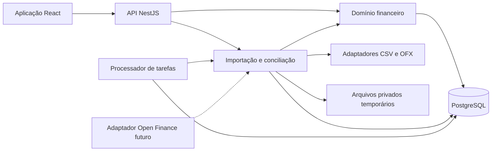

# Rovere Finance — Planejamento técnico, arquitetura e andamento

> **Estado:** planejamento proposto, aguardando aprovação do usuário.
> **Atualizado em:** 8 de outubro de 2026 (America/Sao_Paulo).
> **Autorização atual:** registrar o planejamento neste arquivo. A criação deste documento não constitui aprovação da arquitetura nem autorização para implementar funcionalidades.

## Orientação para qualquer agente que retomar o projeto

- Este é um projeto greenfield. Não reutilizar nem investigar a arquitetura, o banco ou o código da aplicação anterior.
- Leia este documento antes de propor ou executar a próxima etapa. Ele registra o planejamento apresentado ao usuário, não uma implementação concluída.
- CSV e OFX são requisitos obrigatórios da V1, com a mesma prioridade, independentemente de Open Finance. O complemento do usuário prevalece sobre as seções 12 e 22 do briefing original.
- A seção 23 do briefing determina que a implementação aguarde aprovação do usuário. Até o registro deste documento, essa aprovação não foi dada.
- As escolhas de stack, regras sugeridas, limites operacionais e fases abaixo são propostas. Distinguir requisitos expressos do usuário de recomendações ainda pendentes.
- Não inferir silenciosamente dados de parcelas, faturas, totais de compras, saldos ou limites ausentes nos arquivos.
- Atualizar o andamento, decisões e evidências de validação após cada entrega autorizada. Registrar mudanças de decisão com data e justificativa.
- Versões, preços e cobertura de provedores refletem a pesquisa do planejamento em 08/10/2026 e devem ser revalidados antes da adoção ou contratação.

## Andamento e próximo passo

| Item | Estado |
|---|---|
| Leitura do briefing e do complemento obrigatório | Concluída |
| Planejamento funcional e técnico inicial | Apresentado ao usuário |
| Pesquisa de documentação oficial e viabilidade de Open Finance | Realizada para fundamentar a proposta |
| Registro do planejamento na raiz do projeto | Este documento |
| Aprovação da arquitetura e regras propostas | Pendente |
| Implementação, migrações, instalação de dependências e testes executáveis | Não iniciados |
| Próximo passo | Receber aprovação e resolver as decisões de negócio indicadas na seção 13 |

## Proposta apresentada

**CSV e OFX entram como requisitos obrigatórios da V1, com a mesma prioridade.** O complemento do usuário prevalece sobre as seções 12 e 22 do briefing: importação, revisão e conciliação fazem parte do núcleo do produto e não dependem de Open Finance.

A recomendação é um **monólito modular, com React, NestJS e PostgreSQL**, construído em entregas verticais. A primeira entrega financeira já deverá demonstrar o fluxo completo de importar arquivos, revisar centenas de movimentações e registrá-las sem duplicação.

O restante deste documento preserva o conteúdo técnico e funcional do retorno apresentado ao usuário, organizado para consulta no repositório.

## 1. Escopo da V1 e decisões de negócio

O briefing define um MVP abrangente, mas coerente. A redução de complexidade deve ocorrer na profundidade das funcionalidades e na infraestrutura, preservando os fluxos essenciais.

| Obrigatório na V1 | Evolução posterior |
|---|---|
| Autenticação e isolamento entre usuários | Open Finance real |
| Contas, cartões e lançamentos manuais | Gestão avançada de investimentos |
| Importação de extratos e faturas em CSV **e OFX** | PDF, OCR e outros formatos |
| Prévia, correções, conciliação e rastreabilidade | Categorização por IA |
| Compras, parcelas, faturas e pagamentos parciais | Simulações avançadas de crédito |
| Receitas, despesas e assinaturas recorrentes | Compartilhamento familiar de dados |
| Reembolsos e compromissos com terceiros | Aplicativos móveis nativos |
| Categorias, orçamento e dashboard anual | Automações externas adicionais |

Algumas definições precisam ser explícitas desde o início:

- **Pix é um meio de pagamento.** Pode representar receita, despesa, transferência própria, pagamento de compromisso ou recebimento de reembolso.
- **Pagamento de fatura é liquidação de obrigação.** A despesa já está representada pelas compras e encargos correspondentes.
- **Recebimento previsto e dinheiro recebido são informações diferentes.**
- **Ausência de informação não equivale a zero.** Isso vale para saldo, limite disponível, total da compra e quantidade de parcelas.
- **“Realizado” precisa de contexto.** Uma compra pode estar registrada e faturada, mas ainda não paga.

Recomenda-se começar com valores de liquidação em **BRL**, mantendo moeda explícita no modelo. Compras internacionais poderão preservar valor e moeda originais quando informados, mas sua contabilização dependerá do valor efetivamente cobrado em reais.

## 2. Arquitetura e funcionamento geral

O backend será um único sistema implantável, organizado por módulos de domínio. PostgreSQL será a fonte de verdade para lançamentos, vínculos, importações e cálculos financeiros.

O processador de tarefas utilizará o mesmo código do backend. Poderá rodar em processo separado para evitar que parsing e importações prejudiquem as requisições interativas. Uma fila persistida em PostgreSQL é suficiente inicialmente; Redis e mensageria distribuída só seriam introduzidos mediante necessidade medida.

Dentro dos módulos, propõem-se quatro responsabilidades claras: interface HTTP, casos de uso, regras de domínio e persistência/adaptadores. As regras de parcelamento, reconhecimento financeiro e conciliação não dependerão de controllers ou componentes React.

A lista central de movimentações será uma **consulta unificada sobre os conceitos do domínio**. Não será necessário colocar compras, faturas, reembolsos e transferências numa única tabela genérica.

Os padrões têm aplicações concretas:

- **Adapter:** formatos CSV, OFX e provedores futuros.
- **Strategy:** interpretação de layouts e regras explícitas de faturamento.
- **Repository:** persistência de agregados relevantes, sem criar abstrações genéricas para cada tabela.

## 3. Stack recomendada e alternativas

As linhas abaixo foram verificadas na documentação oficial consultada em **8 de outubro de 2026**. Na implementação, as versões exatas deverão ser fixadas e verificadas em conjunto.

| Componente | Proposta | Justificativa |
|---|---|---|
| Frontend | React 19.3 e Vite 8.3 | Aplicação autenticada, predominantemente interativa; construção e hospedagem simples |
| Backend | NestJS 12.1, TypeScript e Node.js 24 LTS | Organização modular e uma linguagem entre frontend e backend |
| Banco | PostgreSQL 18, com atualização corretiva vigente | Transações, restrições relacionais e consultas financeiras |
| Persistência | Prisma 7 estável, com SQL explícito quando necessário | Produtividade sem abrir mão de restrições e consultas específicas |
| API | REST e OpenAPI | Contratos verificáveis e cliente frontend gerado |
| Autenticação | Better Auth com sessões persistidas | Fluxos de autenticação apoiados por biblioteca; sessões revogáveis |
| Consultas frontend | TanStack Query | Cache de dados remotos e atualização após mutações |
| Formulários | React Hook Form e Zod | Validação e formulários adaptáveis |
| Interface | Componentes acessíveis baseados em Radix/shadcn, com tokens próprios | Consistência e controle visual |
| Testes | Vitest, PostgreSQL real em integração e Playwright | Cobertura do domínio, persistência e jornadas |
| Ambiente | Docker Compose e CI no GitHub | Execução reproduzível e validação automática |

As referências oficiais consultadas confirmam as linhas de [React](https://react.dev/versions), [Vite](https://vite.dev/releases), [NestJS](https://github.com/nestjs/nest/releases), [Node.js](https://github.com/nodejs/Release) e [PostgreSQL](https://www.postgresql.org/support/versioning/). A documentação consultada apresenta Prisma 8 como release candidate; por isso, propõe-se a linha 7 estável como base inicial. [Prisma](https://www.prisma.io/docs/prisma-orm/add-to-existing-project/postgresql)

**React versus Next.js:** Next.js oferece renderização no servidor, streaming e Server Components. Esses recursos têm utilidade, mas não são determinantes para este painel autenticado com API própria. A proposta é React com Vite para reduzir as camadas de execução. Next.js poderá ser reavaliado se páginas públicas, SEO ou renderização no servidor se tornarem requisitos relevantes. [Documentação do Next.js](https://nextjs.org/docs/app/getting-started/server-and-client-components)

**NestJS versus Spring Boot:** ambos atendem ao domínio. Spring Boot seria uma boa escolha se o objetivo profissional principal fosse demonstrar Java e seu ecossistema. A documentação consultada apresenta Spring Boot 4.1.1. Para este projeto, recomenda-se NestJS pela continuidade em TypeScript e pelo menor custo de manter duas stacks. A integridade financeira dependerá principalmente do modelo, das transações e dos testes. [Documentação do Spring Boot](https://docs.spring.io/spring-boot/system-requirements.html)

Valores financeiros serão calculados no backend. O frontend formatará os resultados, evitando fórmulas independentes que possam divergir entre telas.

## 4. Módulos e responsabilidades

| Módulo | Responsabilidade |
|---|---|
| Identidade e acesso | Usuários, sessões, recuperação de acesso e autorização |
| Contas | Contas bancárias, carteiras manuais, saldos de referência e extratos |
| Cartões | Contas de crédito, cartões físicos/virtuais/adicionais, faturas e limites |
| Operações financeiras | Receitas, despesas, compras, transferências, ajustes e estornos |
| Planejamento | Recorrências, parcelas previstas e compromissos futuros |
| Terceiros | Pessoas, valores a receber/a pagar e liquidações |
| Importação e conciliação | Arquivos, adaptadores, revisão, correspondências e confirmação |
| Categorias e orçamento | Categorias, regras determinísticas e metas mensais |
| Consultas e relatórios | Visão centralizada, dashboard anual e projeções |
| Auditoria e tarefas | Histórico de alterações, processamento e acompanhamento de falhas |

Cada módulo terá suas regras de escrita. Relatórios poderão consultar dados de vários módulos, mas não alterar seus registros diretamente.

Open Finance entrará posteriormente como outra origem de dados, utilizando os mecanismos existentes de normalização, identidade externa e conciliação.

## 5. Modelagem proposta para o banco

A separação principal será entre **o fato econômico, sua programação, seu movimento de caixa e a evidência de origem**.

| Grupo | Entidades principais | Relações e regras |
|---|---|---|
| Identidade | `User`, `Session` | Dados financeiros pertencem a um usuário |
| Contas | `Account`, `BalanceSnapshot`, `BankEntry` | Uma conta possui movimentos efetivos e saldos observados em datas determinadas |
| Crédito | `CreditAccount`, `Card`, `Statement` | Vários cartões podem compartilhar a mesma conta de crédito, limite e fatura |
| Compras | `Expense`, `InstallmentPlan`, `CardCharge` | Uma despesa pode originar várias cobranças; cada cobrança pertence a uma fatura quando identificada |
| Pagamentos de fatura | `StatementPaymentAllocation` | Vincula movimento bancário ao valor liquidado de uma ou mais faturas |
| Receitas | `Income`, `IncomeSettlement` | Receita prevista pode ser liquidada por movimentos efetivos |
| Transferências | `Transfer` | Liga saída e entrada entre contas próprias, inclusive quando chegam em importações diferentes |
| Terceiros | `Counterparty`, `Receivable`, `Payable`, `DueItem` | Valores a receber/pagar têm calendários independentes |
| Liquidações de terceiros | `ReceivableSettlement`, `PayableSettlement` | Alocam valores efetivos aos compromissos correspondentes |
| Recorrências | `RecurrenceRule`, `ScheduledOccurrence` | Cada ocorrência é gerada uma única vez |
| Planejamento mensal | `Category`, `Budget`, `BudgetLine` | Categoria principal e orçamento por período |
| Importação | `ImportBatch`, `ImportSourceRecord`, `ImportRow`, `MappingProfile` | Arquivo, registro de origem, interpretação e revisão separados |
| Rastreabilidade | `ExternalIdentity`, `ReconciliationDecision`, vínculos de origem | Um registro financeiro pode ter evidências manuais e importadas |
| Auditoria | `AuditEvent` | Registra mudanças relevantes com acesso restrito |

**A conta de crédito é diferente do cartão físico.** Essa distinção resolve cartões virtuais e adicionais que compartilham fatura e limite.

**Uma cobrança importada pode existir sem a compra completa conhecida.** Por exemplo, um arquivo pode informar apenas a parcela 3/10 de R$ 120. O modelo deverá aceitar esse conhecimento parcial sem inventar data original, total exato ou parcelas anteriores.

Campos e restrições essenciais:

- Valores em centavos com `BIGINT`; no código, representação inteira apropriada. Na API, strings para preservar precisão.
- Moeda explícita.
- Datas de compra, processamento, competência, vencimento e pagamento separadas.
- Datas civis em `DATE`; instantes técnicos em UTC, preservando o fuso informado quando existente.
- `user_id` nos registros financeiros e referências compostas que impeçam vínculos entre usuários.
- Unicidade de número de parcela dentro de um plano.
- Unicidade de ocorrência dentro de uma recorrência.
- Identificadores externos únicos dentro do seu escopo documentado de origem e conta.
- Alocações de recebimentos/pagamentos limitadas ao valor disponível, verificadas dentro da transação.
- Controle de versão para impedir que uma confirmação use uma revisão desatualizada.

Para vínculos financeiros, recomendam-se relações tipadas com chaves estrangeiras. Uma referência genérica `tipo + id`, sem integridade referencial, não será suficiente.

## 6. Regras financeiras e prevenção de dupla contagem

Recomendam-se duas perspectivas explícitas na V1:

| Perspectiva | Regra proposta |
|---|---|
| **Planejamento mensal** | Compras no cartão distribuídas pelas competências das faturas; outras receitas e despesas conforme o período definido |
| **Caixa** | Entradas e saídas efetivas das contas, com transferências, reembolsos e liquidações identificados por natureza |

A compra completa continuará consultável pela data original. Não será somada novamente às parcelas no mesmo indicador.

O pagamento de uma fatura aparecerá como saída de caixa e redução de obrigação. Não gerará outra despesa de consumo. Juros e tarifas, quando informados, serão despesas próprias.

O saldo calculado de uma conta partirá de um saldo de referência em data conhecida e dos movimentos posteriores. Um saldo informado pela instituição será preservado como observação para conciliação; não criará automaticamente um ajuste para “fazer bater”.

### Validação com os exemplos do briefing

| Exemplo | Comportamento esperado |
|---|---|
| Guarda-roupa de R$ 1.000 em 5 vezes | Cinco cobranças de R$ 200 e obrigação total preservada |
| Pai reembolsa em 5 vezes | Cinco recebíveis independentes; cada Pix liquida o recebível selecionado |
| Pai paga tudo no primeiro mês | Recebível pode ser liquidado integralmente, mantendo as cinco cobranças do cartão |
| Uber de R$ 50 dividido | Fatura mantém R$ 50; reembolso esperado é R$ 25; custo pessoal esperado é R$ 25 |
| Amigo ainda não pagou o Uber | Caixa recebido permanece zero; o custo efetivo ainda não é reduzido por um recebimento inexistente |
| Passagens compradas pelo irmão | Despesa e obrigação com terceiro, com quatro vencimentos; nenhuma compra é criada num cartão próprio |
| Salário nos dias 15 e 30 | Duas ocorrências previstas; importação posterior liquida cada ocorrência sem criar outra receita |
| Transferência para investimento próprio | Redução da conta de origem e alocação patrimonial; sem despesa de consumo |

Para reembolsos, a interface mostrará separadamente valor original, estorno, reembolso esperado, recebido e pendente. O total recuperável não poderá exceder o valor elegível da despesa sem revisão explícita. Estornos posteriores deverão reabrir essa análise.

Parcelamento manual usará divisão inteira e distribuição determinística dos centavos restantes. Por exemplo, R$ 100 em três parcelas poderá produzir R$ 33,34, R$ 33,33 e R$ 33,33. Valores efetivamente informados pela instituição terão prioridade sobre a distribuição estimada.

Os estados serão separados por dimensão: previsão/registro efetivo, conciliação, liquidação parcial/total e cancelamento/reversão. “Conciliado” não substituirá “pago”.

Para faturas, a identificação inicial seguirá a prioridade solicitada: informação explícita da instituição, período confirmado na importação e estimativa pelo calendário do cartão. **Uma correção manual confirmada será preservada**; nova informação conflitante gerará revisão.

## 7. Importação CSV e OFX: fluxo obrigatório da V1

O fluxo proposto é:

**Enviar arquivo → selecionar destino → interpretar → revisar → conciliar → confirmar → consultar resultado.**

O processamento automático preparará o lote inteiro. O usuário concentrará sua atenção nas exceções e poderá aplicar correções em conjunto.

**CSV:** reconhecimento de layouts conhecidos e mapeamento manual reutilizável. O importador deverá tratar separadores, aspas, descrições com quebras de linha, cabeçalhos extras, encoding, formatos de data, separadores decimais e convenções de débito/crédito. Datas e valores ambíguos exigirão configuração explícita, com exemplos na prévia.

**OFX:** suporte às famílias 1.x baseadas em SGML e 2.x baseadas em XML, para extratos bancários e de cartão. A documentação do mantenedor distingue essas famílias. A compatibilidade será documentada por versões e arquivos de teste, incluindo as variações efetivamente homologadas. [Especificações OFX — Financial Data Exchange](https://financialdataexchange.org/about-fdx/ofx-work-group/)

O adaptador extrairá datas, descrições, valores, moeda, conta e identificadores quando presentes. Guardará também os dados de origem necessários para explicar a normalização.

### Parcelamento e fatura com informação incompleta

| Informação disponível | Ação proposta |
|---|---|
| Parcela e quantidade explicitamente informadas | Preencher os campos e apresentar na revisão |
| Descrição sugere “03/10” | Sugerir interpretação, mostrando o trecho; exigir confirmação |
| Só existe valor da cobrança | Registrar a cobrança conhecida, com parcelamento desconhecido |
| Compra já cadastrada manualmente | Sugerir vínculo à parcela existente |
| Período explícito de faturamento | Associar à fatura correspondente |
| Apenas intervalo do extrato | Não assumir que seja o período da fatura |
| Fatura ausente | Permitir seleção em lote ou manter cobrança com vínculo pendente, sinalizando a limitação |

**Não será permitido multiplicar silenciosamente o valor de uma parcela para inventar o total da compra.** Também não serão geradas parcelas futuras ou anteriores apenas pela semelhança da descrição.

Quando o usuário optar por completar um parcelamento, verá uma proposta com quantidade, valores, primeira parcela conhecida e calendário. As parcelas estimadas serão conciliadas com cobranças efetivas que chegarem posteriormente.

A revisão exibirá os registros como válidos, incompletos, inválidos ou possíveis duplicatas. Antes de confirmar, mostrará quantidades e totais por destino, além do que será criado, vinculado ou ignorado.

Erros críticos nas linhas selecionadas impedirão sua confirmação. Será possível excluir explicitamente linhas problemáticas e confirmar as demais. A gravação do conjunto selecionado será atômica: ou todos os lançamentos e vínculos são gravados, ou nenhum deles.

Propõem-se como limites iniciais **10 MB e 10 mil registros por arquivo**, sujeitos à medição. O aceite funcional deverá demonstrar, no mínimo, uma fatura com **500 compras**, sem cadastro individual. Arquivos com múltiplas contas terão seus blocos separados e destinos confirmados.

Totais declarados pelo arquivo, quando disponíveis, serão comparados com o lote. Diferenças serão apresentadas; não serão compensadas por lançamentos artificiais.

## 8. Conciliação, idempotência e consistência

A prevenção de duplicidades terá três níveis:

| Evidência | Tratamento |
|---|---|
| Mesmo lote já confirmado | Retornar o resultado anterior |
| Mesma identidade externa, no escopo correto, com dados compatíveis | Reconhecer o registro existente |
| Semelhança por data, valor, descrição, conta, parcela e fatura | Apresentar correspondência candidata |

O hash do arquivo ajudará a detectar reenvios, mas não será a única proteção: dois arquivos diferentes podem conter o mesmo período.

**Descrição e valor iguais nunca serão, isoladamente, prova de duplicação.** O usuário poderá vincular ao registro existente, manter ambos ou revisar. Identificador externo repetido com valor ou data conflitante será tratado como divergência ou correção da origem, sem sobrescrita silenciosa.

Ao conciliar, o sistema preservará categorias, observações, reembolsos e correções do usuário. O lançamento existente ganhará um vínculo de origem.

A idempotência será garantida também no banco, com restrições únicas e transações. Na confirmação, o backend verificará novamente destinos, versões e correspondências, pois os dados podem ter mudado desde a prévia.

Uma chave de idempotência ficará associada ao conteúdo do comando: reutilizar a mesma chave com outra decisão produzirá conflito. Falhas transitórias poderão ser repetidas com segurança. Prisma permite configurar transações e níveis de isolamento; operações concorrentes críticas deverão ter tratamento explícito de conflitos e repetição limitada. [Transações no Prisma](https://www.prisma.io/docs/orm/v7/prisma-client/queries/transactions)

As liquidações permitirão relações de vários para vários: um Pix pode pagar dois recebíveis, e um recebível pode ser pago em dois Pix. O controle será pelo valor alocado, impedindo aproveitar o mesmo dinheiro duas vezes.

Reverter uma importação respeitará as dependências criadas depois dela. Registros previamente existentes e apenas conciliados serão desvinculados; não serão apagados como se tivessem nascido naquele lote.

## 9. UX, navegação e dashboard

A navegação principal terá: **Visão geral, Movimentações, Contas e cartões, A receber e a pagar, Orçamento e Importações**.

A ação global “Nova movimentação” adaptará os campos para receita, despesa, transferência, compra, compromisso ou liquidação. O usuário poderá lançar uma despesa sem conta bancária cadastrada, deixando explícito quando não há informação suficiente para calcular o caixa.

A tela de importação terá revisão em tabela, edição em lote, filtros por pendência, comparação com possíveis correspondências e um resumo final. Uma fatura válida com centenas de compras poderá ser confirmada em conjunto.

Na tela de cartão, limite informado e limite estimado terão identificação de origem e data. A soma da fatura atual não será apresentada automaticamente como todo o limite utilizado. Histórico incompleto produzirá aviso de cobertura.

O dashboard anual distinguirá:

- Meses anteriores: registros efetivos e lacunas conhecidas.
- Mês atual: realizado e compromissos ainda previstos.
- Meses futuros: recorrências, parcelas, compromissos e estimativas identificadas.
- Resultado mensal, caixa, orçamento e reembolsos em indicadores separados.

Para evitar dupla contagem nas projeções, propõe-se calcular o complemento de despesas variáveis por categoria como:

`máximo(orçamento da categoria − realizado − compromissos já incluídos, zero)`

O orçamento só adicionará o que ainda não está representado. Sem orçamento ou histórico suficiente, o sistema exibirá projeção incompleta, sem classificar automaticamente o restante da renda como dinheiro livre.

Após alterações, as consultas de movimentações, faturas, recebíveis, orçamento e dashboard serão invalidadas conforme os dados afetados. TanStack Query oferece esse mecanismo; a resposta do backend só indicará sucesso depois da persistência. [Invalidação de consultas](https://tanstack.com/query/latest/docs/framework/react/guides/query-invalidation)

A interface deverá funcionar por teclado, apresentar erros junto aos campos, manter foco previsível e oferecer dados tabulares equivalentes aos gráficos.

## 10. Open Finance: viabilidade e preparação

O acesso aos dados bancários de clientes não é uma API pública liberada apenas por possuir uma conta. O Banco Central informa que a participação no ecossistema é restrita às instituições autorizadas, com condições regulatórias aplicáveis. Para este produto independente, a rota a avaliar é uma contratação/parceria apropriada com provedor habilitado. [Banco Central](https://www.bcb.gov.br/meubc/faqs/s/open-finance)

| Alternativa | Evidência encontrada | O que ainda precisa de validação |
|---|---|---|
| Pluggy | APIs de dados e conectores Open Finance; documentação lista Itaú, Caixa e Nubank | Produtos por conector, faturas, parcelas, limites, contrato e custo final |
| Belvo | Agregação brasileira, consentimentos e processamento de dados de faturas | Cobertura por instituição, disponibilidade dos campos e proposta comercial |
| Klavi | APIs de consentimento, dados financeiros e sandbox | Adequação ao produto, cobertura e custos |
| Participação/parceria direta especializada | Alternativa institucional possível de avaliar | Responsabilidades regulatórias, certificações, operação e viabilidade econômica |

A Pluggy anuncia o produto empresarial de dados **a partir de R$ 2.500/mês**; sua documentação também orienta consultar vendas para habilitar conectores Open Finance. Esse valor não deve ser interpretado como orçamento final da integração. [Preços Pluggy](https://www.pluggy.ai/precos), [conectores Pluggy](https://v2.docs.pluggy.ai/pt/docs/open-finance/overview)

Belvo documenta consentimentos e notificações relacionadas a faturas; a precificação aplicável ao projeto deverá ser confirmada comercialmente. Klavi documenta um sandbox e a transição para planos com instituições reais. [Belvo — integração](https://developers.belvo.com/products/aggregation_brazil/aggregation-brazil-integration-widget), [Belvo — planos](https://belvo.com/pt-br/planos-precos/), [Klavi — API](https://docs.klavi.ai/connect/api-only)

A recomendação é adiar a escolha do provedor até uma prova de conceito comparar **instituição × produto × campo × atualização × custo**. Ter o banco listado não garante disponibilidade de todos os dados desejados.

O desenho futuro incluirá consentimento, escopos, expiração, revogação, renovação, última sincronização, falhas e dados ausentes. Webhooks e sincronizações serão idempotentes. A revogação interromperá novas consultas, com tratamento dos dados já armazenados conforme a política aplicável.

Somente funcionalidades de leitura serão integradas. O ambiente local e a demonstração usarão provedores simulados.

## 11. Segurança, privacidade e operação

A autorização será aplicada a todas as consultas e comandos, incluindo downloads, prévias e tarefas assíncronas. O usuário autenticado virá da sessão, sem confiar num `user_id` enviado pelo cliente.

Propõem-se sessões persistidas e revogáveis, cookies `HttpOnly` e `Secure`, proteção CSRF, expiração e recuperação de acesso por tokens de uso único. Better Auth oferece gerenciamento de sessões que pode servir de base para esses fluxos. [Documentação de sessões](https://better-auth.com/docs/concepts/session-management)

Os arquivos importados terão armazenamento privado, nomes internos aleatórios, prazo de retenção e limites de tamanho, linhas, tempo e memória. O parsing XML deverá desabilitar entidades externas e acesso à rede. Conteúdo importado será tratado como texto; exportações para planilhas deverão neutralizar fórmulas maliciosas.

A aplicação terá validação no servidor, rate limiting, TLS, segredos fora do repositório e criptografia em repouso. Tokens futuros de provedores receberão proteção adicional, com chaves mantidas fora do banco.

Logs operacionais registrarão IDs técnicos, duração, quantidade de linhas e códigos de erro, evitando descrições financeiras, arquivos, senhas e tokens. Auditoria financeira terá acesso e retenção próprios.

A LGPD exige considerar finalidade, necessidade, transparência, direitos do titular e medidas de segurança. A base legal de cada tratamento e os papéis dos fornecedores deverão ser definidos antes de disponibilizar o serviço a terceiros; consentimento de Open Finance não substitui essa análise. [Texto da LGPD](https://www.planalto.gov.br/ccivil_03/_ato2015-2018/2018/lei/l13709.htm)

Como proposta operacional inicial: excluir arquivos brutos após prazo curto, como 30 dias, mantendo a rastreabilidade mínima necessária; oferecer exportação e exclusão de conta; ter backups criptografados e testar restauração. Prazos definitivos dependem da política aprovada.

Docker Compose incluirá frontend, backend, processador de tarefas e PostgreSQL. Migrações terão execução controlada, e a carga de demonstração será separada das migrações. Observabilidade inicial cobrirá disponibilidade, duração das importações, filas, falhas e conflitos de conciliação.

## 12. Testes automatizados e critérios de aceite

Importação terá testes desde a primeira entrega. Os arquivos de teste serão sintéticos, reproduzindo estruturas reais sem expor dados pessoais.

| Cenário | Critério verificável |
|---|---|
| CSV e OFX em lote | Cada formato importa uma fatura de 500 compras, com destino, valores e vínculos preservados |
| CSV heterogêneo | Separadores, encoding, aspas, decimais e datas são interpretados ou apontados para configuração |
| OFX 1.x e 2.x | Arquivos bancários e de cartão homologados geram registros normalizados equivalentes |
| OFX sem parcelas | Nenhuma parcela futura ou total de compra é inventado |
| Fatura ausente | Usuário confirma o período ou mantém pendência visível |
| Arquivo inválido | Erro é explicado e nenhum lançamento financeiro indevido é gravado |
| Erro em parte do lote | Linhas problemáticas são corrigidas ou excluídas explicitamente |
| Reenvio e concorrência | Repetições simultâneas não duplicam os efeitos financeiros |
| Compras iguais | Duas compras legítimas de mesmo valor e descrição podem ser preservadas |
| Conciliação manual/importada | Categoria, observações e reembolsos existentes permanecem |
| Parcelamento | A soma das parcelas é exatamente igual ao total, inclusive com centavos indivisíveis |
| Fechamento | Casos na data de corte respeitam informação explícita e sinalizam estimativas |
| Fatura parcial e estorno | Saldo da obrigação é correto e despesas não são duplicadas |
| Reembolso | Calendário independente, pagamentos parciais e múltiplos recebimentos funcionam |
| Compromisso com terceiro | Pagamento reduz a obrigação sem criar outra despesa |
| Salário recorrente | Importação liquida a previsão correspondente uma única vez |
| Recorrências | Dias 30/31, fevereiro, pausas e cancelamentos seguem política explícita |
| Transferências e investimentos | Não aumentam receitas/despesas de consumo indevidamente |
| Projeção | Orçamento, parcelas e despesas já registradas não são somados em duplicidade |
| Isolamento | Usuário A não lê nem altera registros, arquivos ou lotes de B |
| Atualização da interface | Confirmação atualiza os módulos afetados sem recarga manual |
| Recuperação | Reinício de tarefa ou perda da resposta HTTP não deixa importação parcialmente confirmada |

Testes unitários cobrirão as regras financeiras. Testes de integração usarão PostgreSQL real para restrições, transações e concorrência. Testes de API cobrirão autorização e contratos; testes end-to-end cobrirão as jornadas principais.

A CI executará formatação, lint, tipos, testes, build e verificação de migrações, com análise de dependências e segredos. Desempenho terá medição em ambiente documentado; não se propõe um prazo de processamento sem benchmark.

## 13. Ordem de implementação e aprovação

| Entrega | Resultado revisável |
|---|---|
| **0 — Decisões e contratos** | Regras financeiras aprovadas, modelo, fluxos, matriz de formatos e ADRs iniciais |
| **1 — Fundação e importação completa** | Autenticação, contas/cartões mínimos, CSV e OFX, revisão, persistência e idempotência |
| **2 — Ciclo de cartão** | Compras manuais e importadas, parcelas, faturas, pagamentos, ajustes e estornos |
| **3 — Planejamento e terceiros** | Recorrências, receitas, reembolsos, compromissos e conciliação de liquidações |
| **4 — Orçamento e visão anual** | Categorias, metas, projeções e consultas consolidadas |
| **5 — Preparação da V1** | Segurança, acessibilidade, desempenho, backup, documentação e demonstração |
| **Após V1** | Prova de conceito e eventual contratação de Open Finance |

CSV e OFX serão critérios de conclusão da entrega 1 e do lançamento da V1. Os vínculos mais avançados serão incorporados nas entregas seguintes, sem substituir o mecanismo de importação.

A documentação prevista inclui README com execução local, diagramas de componentes e dados, OpenAPI, catálogo de formatos suportados, exemplos fictícios, regras financeiras, estratégia de testes e ADRs. A demonstração pública deverá apresentar apenas dados fictícios.

### Decisões pendentes antes da implementação

| Decisão | Recomendação apresentada | Estado |
|---|---|---|
| Perspectiva principal do dashboard | Planejamento mensal por competência das faturas, com visão de caixa separada | Aguardando aprovação |
| Reembolsos no orçamento | Mostrar custo bruto e pessoal; escolher explicitamente qual consome o orçamento | Aguardando decisão |
| Parcelas incompletas | Registrar a cobrança conhecida e gerar projeções somente após confirmação | Aguardando aprovação da proposta |
| Dias inexistentes no mês | Ajustar recorrências ao último dia; deslocamento por dia útil configurável | Aguardando aprovação |
| Primeiro conjunto de layouts bancários | Priorizar os arquivos que o usuário utiliza, preservando mapeamento CSV genérico e OFX | Aguardando definição dos layouts |
| Rotativo e renegociação | Registrar saldos e encargos informados, sem estimar juros automaticamente na V1 | Aguardando aprovação |
| Moedas | BRL na contabilização inicial, preservando moeda original quando disponível | Aguardando aprovação |

A solicitação de aprovação apresentada ao usuário foi: **“Você aprova esta arquitetura e a ordem de entregas, especialmente a perspectiva mensal proposta e o tratamento de dados incompletos?”**

A aprovação é necessária porque a seção 23 do briefing determina que a criação de arquivos e a implementação só comecem após essa etapa de planejamento. Posteriormente, o usuário autorizou especificamente a criação deste Markdown; essa autorização não aprova automaticamente a arquitetura ou a implementação.

## Histórico de continuidade

| Data | Registro |
|---|---|
| 2026-10-08 | Briefing analisado; complemento tornou CSV e OFX obrigatórios na V1; proposta técnica e funcional apresentada. |
| 2026-10-08 | Usuário solicitou registrar todo o retorno de decisões e arquitetura em um arquivo Markdown na raiz, para continuidade entre agentes. Documento criado com requisitos, propostas, referências e pendências preservados. |

Quando houver aprovação, registrar aqui a data, o escopo aprovado, eventuais alterações e a próxima entrega autorizada. Manter evidências concretas de testes e entregas futuras; não marcar trabalho planejado como concluído.

