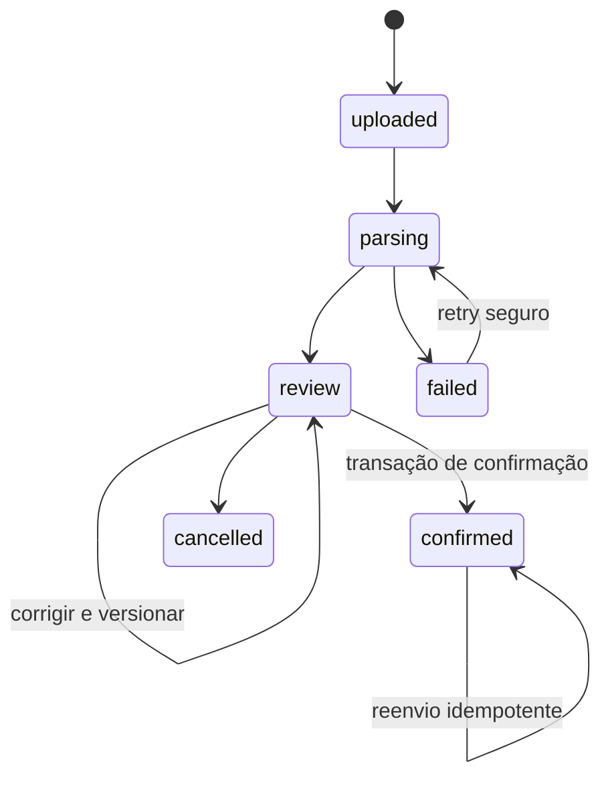

# Contratos e invariantes fundamentais

Estado: primitivas, identidade, destinos, upload/revisão, [confirmação RF-018](import-confirmation.md), [fatos de fatura RF-020](card-statements.md) e [compras RF-021](purchases.md) implementados. Planos, totais calculados/pagamentos, liquidações, orçamento e demais invariantes futuras não concluídos. [Políticas da v0](v0-policies.md) adotadas por delegação; pendências operacionais em [pending.md](decisions/pending.md).

## Convenções

- IDs opacos. A API resolve o proprietário pela sessão; nunca aceita proprietário arbitrário no corpo.
- Dinheiro trafega como `{ currency: 'BRL', cents: '10000' }`. A string é inteira decimal canônica, sem separador, expoente ou sinal `+`; `-0` é inválido. Banco: inteiro de 64 bits. Cálculos usam `bigint` e verificam overflow.
- Datas civis: `YYYY-MM-DD`, calendário gregoriano, anos 0001 a 9999. Instantes: ISO 8601 UTC com timezone original preservado na origem. Não transformar data civil em instante para determinar competência.
- `unknown` é um estado de conhecimento, não zero. Campo ausente não pode se converter em uma parcela, fatura ou total fictício.
- Comandos de escrita financeira futuros recebem chave de idempotência; edições recebem `expectedVersion`. Mesma chave e payload diferente resulta em conflito.
- Erros têm `code`, mensagem legível, `requestId` e violações por campo/linha; não expõem payload financeiro nem stacks ao cliente.
- As interfaces TypeScript não substituem validação de entrada no servidor. DTOs e validadores HTTP serão implementados junto aos endpoints.

## Entidades e fronteiras

| Conceito | Campos fundamentais | Invariante |
|---|---|---|
| Compra/despesa | ID, descrição, categoria, data conhecida, valor total conhecido ou desconhecido, evidências | Compra agregada e suas cobranças não são somadas duas vezes |
| Plano de parcelas | compra, quantidade confirmada, total confirmado, distribuição | Soma das parcelas igual ao total; número único dentro do plano |
| Cobrança de cartão | conta de crédito, cartão opcional, valor cobrado, data informada, parcela conhecida/desconhecida, fatura conhecida/desconhecida | Cobrança real pode existir com compra original incompleta; sem geração silenciosa de parcelas |
| Fatura | conta de crédito, período/competência, fechamento/vencimento conhecidos ou estimados, total declarado opcional | Total declarado e calculado separados; diferença exige revisão |
| Recebível de reembolso | despesa original, terceiro, valor e cronograma | Calendário independente da compra; previsão não altera caixa |
| Obrigação a pagar | despesa/compromisso de origem, terceiro, valor e cronograma | Liquidação não cria novamente a despesa |
| Movimento bancário | conta, valor com direção, data, origem | Cada movimento efetivo altera caixa uma única vez |
| Liquidação | movimento efetivo, recebível/pagável/fatura de destino, valor alocado | Soma das alocações não excede dinheiro disponível; saldo do destino é revalidado sob concorrência |
| Transferência própria | dois movimentos e contas distintas, moeda, vínculo confirmado | Não gera receita/despesa de consumo; uma ponta pode aguardar conciliação |
| Recorrência | dia âncora, início/fim, valor, estado | Ocorrência única por regra e período; preservar âncora após mês curto |

Os vínculos financeiros serão chaves estrangeiras tipadas e com proprietário compatível; os nomes de interfaces não definem sozinhos o schema SQL final.

## Invariantes verificáveis

| ID | Regra | Validação prevista |
|---|---|---|
| INV-01 | Dinheiro não utiliza ponto flutuante e não excede o intervalo do banco | Testes de parsing, overflow e operações exatas |
| INV-02 | Distribuição de centavos preserva exatamente o total, com diferença máxima de um centavo | Testes positivos, negativos, zero e conjuntos de valores |
| INV-03 | Dados ausentes e heurísticas são distinguíveis de fatos confirmados | Contratos discriminados e futuros testes de importação |
| INV-04 | Pagamento de fatura não duplica compra como despesa | Integração de cartão, caixa e relatórios |
| INV-05 | Recebíveis e liquidações preservam cronogramas independentes | Integração de reembolso e alocação |
| INV-06 | Um valor bancário não pode ser alocado duas vezes além do disponível | Teste concorrente em PostgreSQL real |
| INV-07 | Confirmação de lote é atômica e idempotente | Rollback, reenvio e concorrência em PostgreSQL |
| INV-08 | Dados e vínculos não atravessam usuários | Testes de autorização e constraints |
| INV-09 | Correções do usuário sobrevivem à conciliação | Testes de merge explícito |
| INV-10 | Recorrência mantém âncora e usa último dia quando necessário | Fevereiro bissexto/não bissexto e março |
| INV-11 | Orçamento consome valor bruto, sem descontar reembolso previsto | Testes de orçamento futuros |
| INV-12 | Competência e caixa são perspectivas independentes | Testes de consultas financeiras futuras |

Esta lista é contrato de aceite, não declaração de cobertura já existente. Evidências de execução ficam nas tasks.

## Estados independentes

- Registro: `planned`, `recorded`, `cancelled`, `reversed`.
- Liquidação: `unpaid`, `partial`, `paid`, calculada por alocações efetivas.
- Conciliação: `unmatched`, `suggested`, `linked`, `distinct`.
- Fatura: ciclo `open`/`closed`, separado de pagamento e atraso. Atraso deriva do vencimento e saldo, não substitui o ciclo.
- Conhecimento de faturamento: `unknown`, `estimated`, `confirmed`. Estimativa inclui motivo e regra; confirmação inclui origem.

Reversão preserva a evidência original e desfaz efeitos de maneira rastreável. Alterações de compras com recebimentos, estornos ou pagamentos relacionados exigem revalidação das dependências.

## Contrato de importação

1. `ImportSourceRecord`: payload original imutável durante sua retenção, posição no arquivo, formato, versão do adaptador e identificador externo opcional.
2. `ImportCandidate`: data, descrição, valor, moeda, destino sugerido, metadados conhecidos, sugestões e violações. Normalização não grava fatos financeiros.
3. `ImportReview`: versão, destino confirmado, seleção de linhas, correções e decisões de correspondência. Sugestões nunca equivalem a confirmação.
4. `ConfirmImport`: lote, versão esperada e chave de idempotência. O servidor carrega as decisões persistidas e revalida autorização, constraints e saldos.
5. `ImportResult`: contagens de criados, vinculados e ignorados; IDs de rastreabilidade. Nunca retorna sucesso enquanto a transação estiver incompleta.

Fluxo de estados do lote:

Falha da transação mantém o lote em revisão e não publica gravações parciais. Se a resposta for perdida após commit, a mesma chave recupera o resultado anterior. O processamento de parsing usa tarefa persistida com tentativas e recuperação de trabalho interrompido. Um lote em revisão não pode ser reprocessado por um retry antigo sem verificar estado/versão.

Decisões por linha: `create`, `link` (ID existente autorizado), `skip`. “Manter ambas” significa `create` com decisão explícita de que a correspondência é distinta. Identidade externa conflitante exige resolução; não pode ser contornada por um merge aproximado.

Campos de parcela, fatura e total usam estado de conhecimento e proveniência. Uma sugestão “03/10” é carregada separadamente; só vira informação confirmada após ação do usuário. BIZ-03 resolvida: linhas de cartão sem competência permanecem na revisão; confirmação financeira exige período informado e confirmado ([ADR-0005](decisions/0005-missing-statement-period.md)).

## Esboço dos contratos HTTP futuros

| Método e rota | Entrada/saída | Condições |
|---|---|---|
| `POST /api/imports` | multipart CSV/OFX; retorna lote | Sessão, limites, arquivo privado, nenhuma movimentação criada |
| `GET /api/imports/:id` | Estado e progresso | Proprietário autorizado |
| `GET /api/imports/:id/rows` | Paginação e filtros | Prévia não implica confirmação |
| `PATCH /api/imports/:id/review` | expectedVersion e decisões por linha/em lote | Conflito se versão mudou; validação por linha |
| `POST /api/imports/:id/confirm` | expectedVersion; `Idempotency-Key` no header | Confirmação atômica; 409 para conflito |
| `POST /api/expenses` | Despesa e dados conhecidos | Não inventar conta/caixa ausentes |
| `POST /api/expenses/:id/installment-plan` | Total, quantidade e calendário confirmados | INV-02; regras de atribuição de fatura respeitadas |
| `POST /api/receivables` | Despesa, terceiro e cronograma | Origem autorizada e limite de reembolso |
| `POST /api/settlements` | Movimento, destinos tipados, alocações | INV-06; transação e concorrência |

DTOs OpenAPI completos, erros e exemplos financeiros serão detalhados quando a task do endpoint se aproximar. Não gerar SDK de endpoints ainda inexistentes. As rotas já executáveis da RF-013 estão em [identidade](identity.md); liveness e readiness de banco são distintas.
